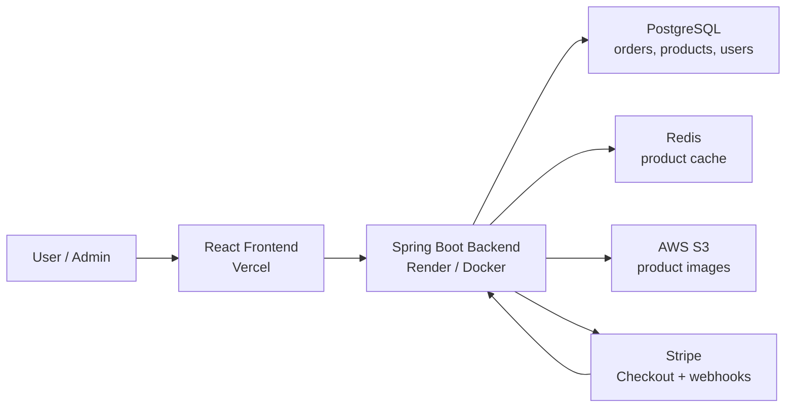
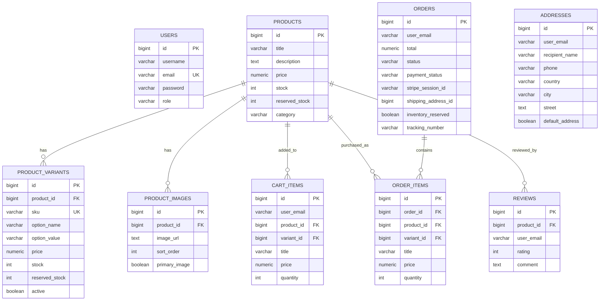

# Full-Stack E-Commerce Platform

[](https://github.com/Ceciliaaabbc/ECommerce_Project/actions/workflows/backend-tests.yml)

A full-stack e-commerce application with a React storefront, Spring Boot REST API, PostgreSQL persistence, Redis-backed product caching, AWS S3 product image upload support, and Stripe Checkout payment integration.

- Frontend repo: [Ceciliaaabbc/ecommerce-frontend](https://github.com/Ceciliaaabbc/ecommerce-frontend)
- Backend repo: [Ceciliaaabbc/ECommerce_Project](https://github.com/Ceciliaaabbc/ECommerce_Project)
- Live demo: [https://ecommerce-frontend-one-theta.vercel.app](https://ecommerce-frontend-one-theta.vercel.app)


## Tech Stack

| Layer | Technologies |
| --- | --- |
| Frontend | React, Vite, React Router, TanStack Query, Playwright |
| Backend | Java 17, Spring Boot 3, Spring Web, Spring Security, Spring Data JPA |
| Database | PostgreSQL, Flyway migrations |
| Cache | Redis |
| Auth | JWT, role-based authorization |
| Payments | Stripe Checkout, Stripe webhook handling |
| Storage | AWS S3-compatible product image upload configuration |
| DevOps | Docker, Docker Compose, Maven, GitHub Actions, Vercel, Render |
| Testing | JUnit 5, Mockito, Spring Boot Test, Testcontainers, MockMvc, Playwright |

## Architecture



## Core Features

- User registration and login with JWT authentication.
- Product browsing with keyword, category, price range, sorting, pagination, variants, and image support.
- Shopping cart with quantity updates, variant selection, stock validation, and item removal.
- Checkout flow that creates a pending order, reserves inventory, and starts a Stripe Checkout session.
- Stripe webhook handling that marks orders as paid, deducts inventory, and clears the cart.
- Order history, order detail pages, payment retry, and unpaid order cancellation.
- Admin dashboard for sales summary, paid/unpaid order counts, user counts, product counts, and low-stock alerts.
- Admin product management with create, edit, delete, search, pagination, low-stock filtering, and image upload.
- Admin order management with filtering, status updates, shipping tracking, and refunds.
- Admin user management with role updates and user deletion.
- Inventory reservation logic for checkout, cancellation, expiration, and payment completion.

## API Examples

Register a user:

```bash
curl -X POST http://localhost:8080/api/users/register \
  -H "Content-Type: application/json" \
  -d '{
    "username": "Test User",
    "email": "test@example.com",
    "password": "123456"
  }'
```

Log in and receive a JWT:

```bash
curl -X POST http://localhost:8080/api/users/login \
  -H "Content-Type: application/json" \
  -d '{
    "email": "test@example.com",
    "password": "123456"
  }'
```

Browse products:

```bash
curl "http://localhost:8080/api/products/browse?keyword=lamp&page=0&size=12&sort=priceAsc"
```

Add an item to cart:

```bash
curl -X POST http://localhost:8080/api/cart \
  -H "Authorization: Bearer <JWT_TOKEN>" \
  -H "Content-Type: application/json" \
  -d '{
    "productId": 1,
    "variantId": 1,
    "quantity": 2
  }'
```

Create a checkout session:

```bash
curl -X POST "http://localhost:8080/api/orders/checkout?shippingAddressId=1" \
  -H "Authorization: Bearer <JWT_TOKEN>"
```

Admin search orders:

```bash
curl "http://localhost:8080/api/orders/admin/search?status=PROCESSING&page=0&size=10" \
  -H "Authorization: Bearer <ADMIN_JWT_TOKEN>"
```

Stripe webhook endpoint:

```bash
POST /api/payments/webhook
```

## Database Schema



## Running
https://ecommerce-frontend-one-theta.vercel.app


## Running Locally

This project lives as a single local directory (`ePlatform/`) containing two subfolders:

```
ePlatform/
├── Backend/    (Spring Boot API + docker-compose.yml)
└── Frontend/   (React app)
```

Start the full stack from the `Backend` folder:

```bash
cd ePlatform/Backend
docker compose up --build
```

Local URLs:

- Frontend: [http://localhost:5173](http://localhost:5173)
- Backend API: [http://localhost:8080](http://localhost:8080)
- Health check: [http://localhost:8080/actuator/health](http://localhost:8080/actuator/health)
- Swagger UI: [http://localhost:8080/swagger-ui.html](http://localhost:8080/swagger-ui.html)

`docker-compose.yml` starts PostgreSQL, Redis, the Spring Boot backend, and the React frontend. For real Stripe/S3 usage, replace the local placeholder environment variables with valid credentials.

### Running the backend without Docker

`Backend/src/main/resources/application.yml` requires these environment variables with no defaults — the app fails to start if any are missing:

- `DATABASE_URL`
- `DATABASE_USERNAME`
- `DATABASE_PASSWORD`
- `REDIS_URL`
- `JWT_SECRET`
- `STRIPE_SECRET_KEY`
- `STRIPE_WEBHOOK_SECRET`
- `FRONTEND_URL`

`PORT` (default `8080`), `ORDER_EXPIRATION_MINUTES` (default `30`), `AWS_REGION` (default `us-east-1`), and `AWS_S3_BUCKET` (default `local-placeholder-bucket`) are optional — S3 upload calls will fail without real AWS credentials, but the app will still start.

Start just PostgreSQL and Redis with Docker, then run the backend directly with Maven:

```bash
cd ePlatform/Backend
docker compose up postgres redis -d --wait   # waits for the healthcheck instead of returning immediately

export DATABASE_URL=jdbc:postgresql://localhost:5432/ecommerce
export DATABASE_USERNAME=ecommerce
export DATABASE_PASSWORD=ecommerce
export REDIS_URL=redis://localhost:6379
export JWT_SECRET=local-development-secret-key-change-before-production
export STRIPE_SECRET_KEY=sk_test_local_placeholder
export STRIPE_WEBHOOK_SECRET=whsec_local_placeholder
export FRONTEND_URL=http://localhost:5173

mvn spring-boot:run
```

Then run the frontend in dev mode instead of via Docker:

```bash
cd ePlatform/Frontend
npm install
npm run dev
```

### Troubleshooting

- **`port is already allocated` on 5432/6379:** something else on your machine is already bound to those ports — check `docker ps` for stray containers, or `lsof -nP -iTCP:5432 -sTCP:LISTEN` / `lsof -nP -iTCP:6379 -sTCP:LISTEN` for a native Postgres/Redis service (e.g. `brew services stop postgresql@16`).
- **Flyway `Migration checksum mismatch`:** the local Postgres volume has migration history from a different copy of the schema. For local dev this is safe to reset: `docker compose down -v` (drops local data), then start again.
- **`Connection refused` connecting to Postgres:** the container needs a few seconds to finish initializing after `docker compose up`. Use `docker compose up postgres redis -d --wait` so the command blocks until the healthcheck passes.

## Testing

Backend tests:

```bash
mvn test
```

Frontend tests:

```bash
cd ../Frontend
npm test
npx playwright test
```

The backend test suite covers:

- Unit tests for service-layer business logic, including `InventoryService`, `OrderService`, `OrderStateMachine`, `OrderAddressSnapshotService`, and `JwtUtil`.
- Controller tests for user, product, cart, and order endpoints.
- Spring Boot integration tests with PostgreSQL/Testcontainers and Flyway migrations.
- API flow tests with MockMvc for registration, login, add-to-cart, checkout, payment webhook status updates, and admin refund.
- Negative cases for insufficient stock, missing-token access, non-admin access to admin APIs, duplicate payment, and order cancellation releasing reserved inventory.
- Full order lifecycle coverage from checkout and payment webhook through shipping, delivery, completion, and refund.
- PostgreSQL concurrency coverage proving pessimistic row locking prevents two transactions from reserving the final unit of stock.

Stripe calls are mocked at the boundary in tests, so the backend suite validates application behavior without contacting external payment services.

Integration tests use PostgreSQL Testcontainers by default. For a local PostgreSQL instance, set `ECOMMERCE_TEST_DB_URL`, `ECOMMERCE_TEST_DB_USERNAME`, and `ECOMMERCE_TEST_DB_PASSWORD` before running Maven tests.

GitHub Actions runs backend tests on pushes and pull requests to `main`.
